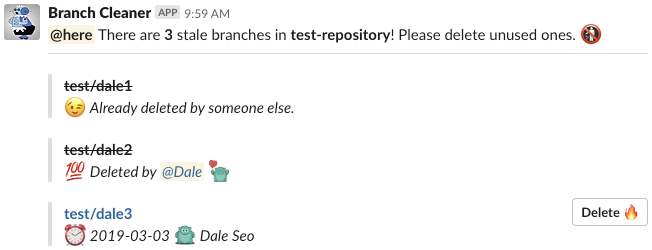

# Branch Cleaner

> Be aware of branches that you forgot to delete.

## Problem

It gets difficult to keep your repositories clean as your project scales with more and more developers.
It would be ideal if developers could always clean up the branches that they created when the branches are no longer used.
However, in reality, it takes some time and energy to make sure unused branches are deleted in a timely manner.

### What are unused branches?

[According to Github](https://help.github.com/en/articles/viewing-branches-in-your-repository), stale branches are all branches that no one has committed to in the last three months. They are considered to be branches to delete.

### Why we easily forget to delete them?

-   Developers just forget to delete it once the branch is merged or forget about temporary branches that they created for experiment or research.
-   Branches are not always merged not by the developer. It can be merged by a QA or another developer and they hesitate to delete others' branches.
-   When someone leaves your team/organization, he or she often leaves all of his branches uncleaned.

## Solution

Branch Cleaner is a very simple solution for preventing your repositories from being polluted with unused branches.
This Slack bot reminds you of unused branches and enable you to delete them right away on Slack.
It encourages developers to be aware of branches that they forgot to delete and get into the habit of cleaning up repositories themselves.



### How it works?

This Slack bot does the following tasks travelling back and forth between [Github API](https://api.github.com) and [Slack API](https://api.slack.com/).

-   Fetch all branches of a repository from Github.
-   Search for unused branches and order them with the oldest ones first.
-   Post messages containing the detail on unused branches and a delete button to the channel of your choice on Slack.
-   When the delete button on a message is clicked, delete the branch from the Github repository and then update the Slack message.

## API (Serverless functions)

-   Remind of unused branches on slack. (Schedule it to be triggered regularly and also can call it manually.)

```sh
curl "http://localhost:9000/remind?owner=<owner>&repository=<repository>&channel=<channel>"
```

-   Delete branch and then update the message. (Called by Slack when the delete button is clicked on a message.)

```sh
curl -X POST "http://localhost:9000/slack" -d "<slack request payload>"
```

## Configurations

Use environment variables or create `.env` file to define the following config items.

-   GITHUB_TOKEN
-   SLACK_TOKEN
-   SLACK_SIGNING_SECRET

## Commands

## Run unit tests

```
$ npm test
```

## Build app

```
$ npm run build
```

## Run app

```
$ npm run serve
```
